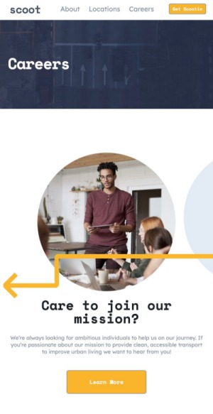

# Frontend Mentor - Scoot website solution

This is a solution to the [Scoot website challenge on Frontend Mentor](https://www.frontendmentor.io/challenges/scoot-multipage-website-N76alNPRJ). Frontend Mentor challenges help you improve your coding skills by building realistic projects. 

## Table of contents

- [Overview](#overview)
  - [The challenge](#the-challenge)
  - [Screenshot](#screenshot)
  - [Links](#links)
- [My process](#my-process)
  - [Built with](#built-with)
  - [What I learned](#what-i-learned)
  - [Continued development](#continued-development)
  - [Useful resources](#useful-resources)
- [Author](#author)
- [Acknowledgments](#acknowledgments)


## Overview

### The challenge

Users should be able to:

- View the optimal layout for each page depending on their device's screen size
- See hover states for all interactive elements throughout the site

### Screenshot
#### Mobile View

---
#### Tablet View

---
#### Laptop View


### Links

- Solution URL: [Scoot Multipage Website](https://your-solution-url.com)
- Live Site URL: [Scoot Multipage Website](https://scoot-multipage-website-tlp.vercel.app/)

## My process

### Built with

- Semantic HTML5 markup
- Bootstrap 5
- Flexbox
- Mobile-first workflow
- SCSS for style


### What I learned

Background elements: I have worked on webpages with background elements and accent images before. I realized that it was better to place them as a background image instead of adding the image within my HTML. I also used percentages to help position the images. That kept the images placed consistently across different screen sizes. 


Code Snippet below:

```css
.pattern--leftuparrow1 {
		background-image: url('../../assets/patterns/left-upward-arrow.svg');
		background-size: contain;
		background-repeat: no-repeat;
		width: 48rem;
		height: 10rem;
		left: 5%;
		bottom: 15%;
		z-index: 2;

		@include bp-tablet-up {
			left: -24%;
		}

		@include bp-desktop-up {
			width: 60rem;
			height: 12rem;
			bottom: 8%;
			left: -30%;
		}

	}

  .pattern--rightwarrow1 {
		background-image: url('../../assets/patterns/right-arrow.svg');
		background-size: contain;
		background-repeat: no-repeat;
		width: 46rem;
		height: 10rem;
		top: 3%;
		left: -36%;
		z-index: 2;

		@include bp-tablet-up {
			top: 5%;
			left: -55%;
		}

		@include bp-desktop-up {
			width: 60rem;
			height: 12rem;
			top: 0%;
			left: -75%;
		}
	}
```


### Continued development

My goal is to continue to improve my coding skills with HTML, CSS, and JS. 

### Useful resources

- [5 Steps to Implement Maintainable and Scalable Sass Theming in Complex Projects](https://medium.com/javascript-in-plain-english/5-steps-to-implement-maintainable-and-scalable-sass-theming-in-complex-projects-76bb6da0a8e6) - This was a very good article about how to organize your folder structure for Sass.
- [How to Use Floating Elements to Improve Your Web Design](https://adwebstudiouae015.medium.com/how-to-use-floating-elements-to-improve-your-web-design-2393d1d4fd66)
- [Creating Accordion with Javascript](https://medium.com/@vikash20186/creating-accordion-with-javascript-a33743655474)
- [How to change color of SVG](https://qawithexperts.com/article/html/how-to-change-color-of-svg-various-ways-using-css/414)
- [Change arrow Color in Bootstrap](https://stackoverflow.com/questions/66335238/changing-the-color-arrow-in-bootstrap)
- [How to change the accordion's color?](https://github.com/twbs/bootstrap/discussions/37229)


## Author

- Website - [T. Lanette Pollard](https://github.com/tlanettepollard)
- Frontend Mentor - [@tlanettepollard](https://www.frontendmentor.io/profile/tlanettepollard)
- Twitter - [@TpLanetteNBCT](https://twitter.com/TpLanetteNBCT)


## Acknowledgments

- [Simon Hernandez](https://github.com/simonhernandez/scootMultiPage): I like how he structured his HTML code.

